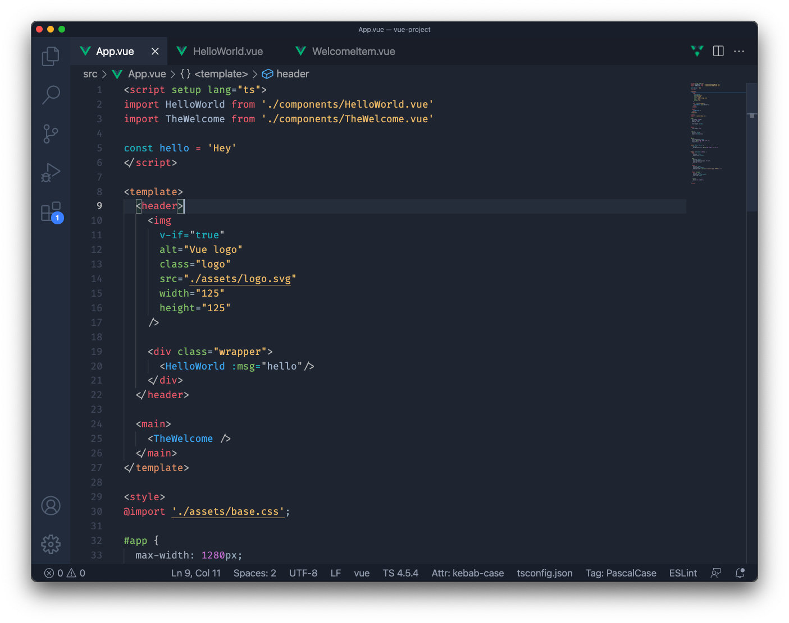
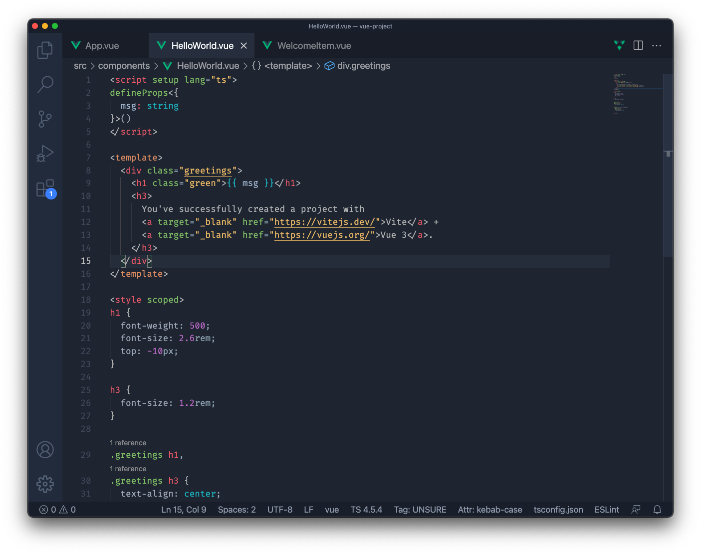

# Indielayer Theme

This extension for Visual Studio Code add the theme titled "Indielayer (Dark)".

## Preview
**Example 1**

**Example 2**

## Installation

1. Open **Extensions** sidebar panel in Visual Studio Code. `View → Extensions`
1. Search for `Indielayer Theme`
1. Click **Install**
1. File > Preferences > Color Theme > **Indielayer (Dark)**
1. Optional: Use the recommended settings below for best experience

## Recommended Settings
{
  "editor.fontSize": 12,
  "editor.fontFamily": "Fira Code",
  "editor.lineHeight": 18,
  "editor.tabSize": 2,
  "editor.autoIndent": "full",
  "editor.fontLigatures": true,
  "editor.suggestSelection": "first",
  "editor.tabCompletion": "on",
  "workbench.iconTheme": "material-icon-theme",
  "workbench.colorCustomizations": {},
  "workbench.colorTheme": "Indielayer (Dark)"
  "zenMode.centerLayout": false,
}

## Fonts

[Fira Code](https://github.com/tonsky/FiraCode) is a free monospaced font with programming ligatures.

## Customizing

If you want to customize on top of this theme, use vscode's [color customization](https://code.visualstudio.com/docs/getstarted/themes#_customizing-a-color-theme) feature.

## Feedback

If you have suggestions, please [open an issue](https://github.com/indielayer/vscode-indielayer-theme/issues) or better yet, a [pull request](https://github.com/indielayer/vscode-indielayer-theme/pulls).

Be nice.

## Credits

This theme was inspired by the themes Monokai and One Dark theme.

## Author

Authored by [João Teixeira](https://github.com/jpntex)